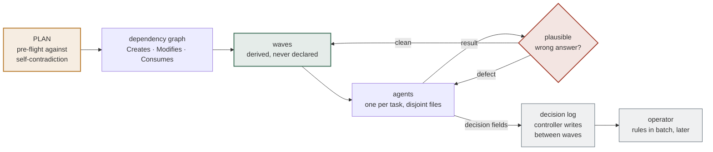

`PUBLIC` · `CLAUDE CODE PLUGIN` · `5 SKILLS` · `PYTHON 3.12 · STDLIB ONLY` · `MIT`

---

**A plan-execution layer whose real job is catching the answer that looks right.**

It sits on top of `superpowers:subagent-driven-development`, which runs a written
plan with one subagent per task and a review after each. That flow works. What it
lacks is **scheduling** — its loop reads as sequential even when tasks share
nothing — **visibility**, and a review lens aimed at the way data code actually
fails: not with an error, but with a confident wrong number.

Every rule here traces to a run that went wrong. Nothing was added because it
sounded like good practice. The site is [spp.datalos.dk](https://spp.datalos.dk).

---

## Install

```bash
curl -fsSL https://spp.datalos.dk/install.sh | sh
wget -qO-  https://spp.datalos.dk/install.sh | sh
fetch -o - https://spp.datalos.dk/install.sh | sh   # FreeBSD
# then:  … | sh -s -- --project
```

The one-liner can live on the site. The files it installs come from this repo (`raw.githubusercontent.com/mikl0s/spp/main`). Override with `SPP_ORIGIN`.

`--project` writes into the current repo (Claude `--scope project`, plus
`.claude/skills` / `.grok/skills` here). Default is global, for this user.

python3 is optional. Skills and `/spp` install without it. The statusline,
`wavemap.py`, and `validate.py` need it. The installer names the ten common
package-manager commands and will run the one it recognises if you pass
`--install-python`. Anything else: install Python 3 yourself and re-run.

It also offers three companions — it will not install them unless you ask:

```bash
… | sh -s -- --with-deps
```

| Plugin | Why |
|---|---|
| `superpowers` | Required. spp layers on it. Official marketplace. |
| `ponytail` | Integral. The lazy lens on orchestrator decisions. |
| `frontend-design` | Separate official plugin, not part of superpowers. Distinctive UI. |

They stay installed if you later remove spp.

From a checkout: `./install.sh`, `./install.sh --project`, `./install.sh update`,
`./install.sh --check`, `./install.sh --dry-run`.

A clean-machine install, reproducible: `./e2e/run.sh` (docker or podman).
`./e2e/run.sh all` is the skills-only path as well — that is what CI runs.

Once installed, the short slash is `/spp` (same as `/superpowers-plus`). Update
from inside a session with `/spp-update` or `/superpowers-plus:update`.

A global install also wires Claude Code's status line (model, current todo,
directory, context used). It turns amber at 50% — the pause threshold — and
replaces a GSD statusline if that is what is there. Restore with
`./install.sh uninstall` or skip with `--no-statusline`.

The installer prefers each tool's own plugin command (`claude plugin …`,
`grok plugin install`). If a marketplace of the same name already points at a
different checkout, it leaves that marketplace alone and links this copy into
the skill directories instead — so it cannot silently replace someone else's
install.

It covers the same runtimes GSD does: Claude, Cursor, Gemini, Codex, Grok,
Copilot, Antigravity, Windsurf, Augment, Trae, Qwen, Hermes, CodeBuddy,
OpenCode, and Kilo. A runtime is seeded when its CLI is on PATH or its
config directory already exists. Global links go in that runtime's skills
dir; `--project` uses `.<name>/skills` under the repo root.

The `superpowers` plugin is required — this one layers on it, it does not
replace it. Then invoke `superpowers-plus` at the start of any plan execution.

To see a plan collapse into waves without installing anything:

```bash
python3 skills/superpowers-plus/wavemap.py            # Nerd Font + colour
python3 skills/superpowers-plus/wavemap.py --plain    # ASCII
NO_COLOR=1 python3 skills/superpowers-plus/wavemap.py # no colour
```

---

## The idea in one diagram



Two tasks may run together when their `Creates ∪ Modifies` sets are disjoint and
every `Consumes` is already committed. A task's wave is `1 + max(wave of its
dependencies)` — **computed, so it cannot claim parallelism the graph forbids.**

---

## Read in this order

| # | Document | Lines | Why |
|:-:|---|--:|---|
| 1 | **[`skills/superpowers-plus/SKILL.md`](skills/superpowers-plus/SKILL.md)** | 289 | **Start here.** Eight rules and the red-flag table |
| 2 | [`docs/FAILURE-MODES.md`](docs/FAILURE-MODES.md) | 355 | The catalogue behind the review lens — fourteen entries |
| 3 | [`skills/decision-log/SKILL.md`](skills/decision-log/SKILL.md) | 242 | How an autonomous run records what it decided |
| 4 | [`skills/decision-review/SKILL.md`](skills/decision-review/SKILL.md) | 352 | How the operator rules on it afterwards |

Every rule cites the failure that motivated it. Where no real incident exists,
the provenance cell says so rather than inventing one.

---

## What it adds

| § | Rule | The failure it answers |
|:-:|---|---|
| 1 | Waves from a dependency graph | 13 tasks ran one at a time; six of them shared nothing |
| 2 | A progress meter on every update | Status with no sense of position — and it decays exactly when updates get long |
| 3 | Dispatch prompts: context, not history | Agents deciding without the context that would have changed the decision |
| 4 | Pre-flight, **mandatory** | Three self-contradictions found in one plan before task 1 |
| 5 | The silent-wrongness review lens | Nearly every serious finding in the original run |
| 6 | Real-data results are findings | A 24% gap visible only in one task's output figure |
| 7 | Pause at the context threshold | A window that ran out mid-task with subagent output unprocessed |
| 8 | Ledger additions | Controllers re-dispatching completed work after compaction |

> **Derive the schedule, never declare it.** A hand-written wave number silently
> claims parallelism the graph forbids — and an omitted dependency entry reads as
> *no dependencies* and lands in the first wave. Both were committed, in a real
> run, by the tool built to prevent them.

---

## The review lens

The base rubric asks whether code is correct and well-tested. It does not
specifically hunt code that produces a **plausible wrong answer instead of
failing** — and that is what nearly every serious finding turns out to be.

<details>
<summary><b>The fourteen catalogued failure modes</b></summary>

<br>

The unifying property: **none of these raise an error.** Tests pass, the run
reports success, and the number is used to make a decision.

| # | Mode | The tell |
|:-:|---|---|
| 1 | Missing values becoming defaults | `0` is a legitimate value, so it becomes a result |
| 2 | Partial coverage that looks total | A pattern handling the common shape, silent on a variant |
| 3 | Silent skips | A loop that `continue`s past malformed input with no counter |
| 4 | Counts that overstate | "items processed" after dedup, replacement or drop |
| 5 | Over-strict validation from a fix | Trades a wrong-value bug for a missing-record bug |
| 6 | Scope that widens silently | Each step defensible, the sum outside the brief |
| 7 | Tests that pass against the bug | Never observed failing, so it locks in nothing |
| 8 | Depending on another system's incidental path | The column would have been uniformly zero |
| 9 | Plan-level self-contradiction | A test asserting the opposite of what it tests |
| 10 | Guards that report green while asserting nothing | `exit 128` → `wc -l` prints `0` → "prints nothing" passes |
| 11 | The harness that never ran the thing it measured | A mutant that never applied; a `git show` that failed into an empty program |
| 12 | A number in prose is an assertion with nothing behind it | "Six of them" — there were ten; a roster stale one commit after writing |
| 13 | A replacement that inherits nothing | A better predicate wired *in front of* the old check instead of beside it |
| 14 | Instructions the actor never sees | A prohibition one line outside the closing quotation mark |

Entry 10 arrived with four instances of one shape in a single phase, each found
only by *executing* the check rather than reading it. Entries 11–14 came from
building this repo's own autonomy contract — six instances of 11 in one day, in
the tooling written to catch exactly that. Full detail in
[`docs/FAILURE-MODES.md`](docs/FAILURE-MODES.md).

</details>

> **An assertion never observed failing is not an assertion.** Every guard needs
> a paired negative case. The decisive test is removing what it detects: a
> vanished finding must diff as loudly as a new one.

---

## The autonomy contract

Two companion skills, for runs that proceed without the operator present.

**`decision-log`** — an agent that hits an ambiguity does not stall. It takes the
most defensible option, returns the decision with its result, and the controller
records it between waves. Every orchestrator decision carries **two lenses**: one
asking what the plan requires, one asking what the least that works is. Where
they agree, the entry is safely bulk-approvable. Where they disagree, both
positions are recorded at equal weight, and the tie breaks on blast radius.

**`decision-review`** — the operator's catch-up pass. Non-consensus entries are
questioned individually and flagged loudly; everything else is offered as a
single bulk accept. The log is append-only, and a cursor records how far review
has reached.

**`validate.py`** — 15 checks, 41 assertions, stdlib only. Its job is narrow and
absolute: an entry it fails to notice is a decision the operator never sees. Its
own self-test is mutation-tested, because a checker that reports success without
having run is indistinguishable from one that ran and passed.

```bash
python3 skills/decision-log/validate.py docs/DECISIONS.md   # 0 valid · 1 problems · 2 broken
python3 skills/decision-log/validate.py --self-test
```

---

## Two rules that bite

> **⛔ Every rule must trace to an observed failure.**
>
> Before adding one, name the run where its absence caused a problem and record
> it in `docs/FAILURE-MODES.md`. A rule nobody can motivate is a rule that gets
> skipped under pressure — and a provenance row describing no real incident is
> folklore with a citation format, which is worse than a blank cell.

> **⛔ Keep it general, and prefer deleting a rule to adding one.**
>
> No project names, no file names from a specific codebase, no
> technology-specific advice. Every rule competes for attention with the base
> skills, and each one added dilutes the rest. An early draft leaked one
> project's file names into the skill and was useless to anyone else.

---

## Layout

```
install.sh             the one-liner — global or --project
install.py             the installer the shell script execs
files.txt              payload the one-liner fetches when not in a checkout
e2e/                   clean-machine install, same command CI runs
.github/workflows/     ./e2e/run.sh all
skills/
  superpowers-plus/    the scheduling and review skill · wavemap.py
  decision-log/        entry format, two-lens rule · validate.py
  decision-review/     operator triage walk
  repo-readme/         this README's house style, as a reusable skill
  project-bootstrap/   writes a new project's CLAUDE.md and seeds its log
docs/
  FAILURE-MODES.md     the catalogue behind the review lens
  assets/banner.svg    the banner above
LICENSE                MIT
```

---

<details>
<summary><b>Status</b></summary>

<br>

| | |
|---|---|
| Scheduling · meter · review lens | ✅ in use |
| `decision-log` · `decision-review` · `validate.py` | ✅ shipped |
| Claude statusline — model, todo, dir, context meter | ✅ shipped (`statusline.py`) |
| Live run state — libSQL, hooks, live meter | 📐 specced, not built |
| Operator web UI — Leptos, passkeys, LAN-only | 📐 not built |
| Hindsight — across-run retrospective | 📐 not built |
| `wavemap.py` reading live state | ⏸ blocked on the run database |

</details>

---

## License

[MIT](LICENSE). Copyright © 2026 Mikkel Georgsen.

---

*Built by running it on itself. The plan that produced the autonomy contract was
executed by the skill it was documenting — which is how the breaker got tested
twice, the progress meter was caught decaying mid-run, and four separate guards
were found reporting green while asserting nothing.*
