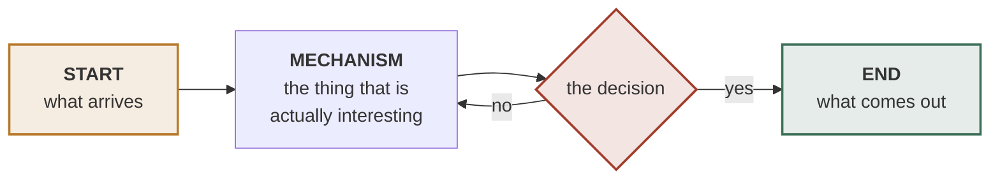

# Front-page skeleton

Fill in and delete what does not apply. Angle brackets are placeholders.
Keep the `---` rules between sections; they are what makes the page scan.

---

```markdown


`<STATUS>` · `<KIND>` · `<STACK>` · `<SCALE>`

---

**<One bold sentence. The whole bet.>**

<What exists today and what it lacks — two or three sentences. Then why this
exists, in one more. If there is a joke in the name, it goes here, not in a
technical section.>

---

## The idea in one diagram



<One sentence naming the bet the diagram makes, and what it depends on.>

---

## Read in this order

| # | Document | Lines | Why |
|:-:|---|--:|---|
| 1 | **[`<path>`](<path>)** | <n> | **Start here.** <what it settles> |
| 2 | [`<path>`](<path>) | <n> | <what it settles> |
| 3 | [`<path>`](<path>) | <n> | <what it settles> |

<One line on the evidentiary standard: what every claim carries, and what each
document does when something could not be verified.>

---

## <Body section — one idea>

<Two or three sentences. Then, where the section reaches a conclusion worth
remembering out of context:>

> **<The verdict, in one line.>** <One sentence of why.>

<details>
<summary><b><The depth a second reader wants></b></summary>

<br>

<Tables, specifics, evidence, file:line citations. Anything that would break the
scan if it sat inline.>

</details>

---

## <Constraints — only the non-negotiable ones>

> **⛔ <The constraint, imperative.>**
>
> <Why it holds, and what happens if it is ignored. Cite the source.>

> **⛔ <The second constraint.>**
>
> <Same shape. Two is usually enough; four means none of them are special.>

---

## Layout

```
<dir>/          <what lives here>
  <sub>/        <what lives here>
<file>          <what it is>
```

<One line on anything deliberately absent, and why.>

---

<details>
<summary><b>Status</b></summary>

<br>

| | |
|---|---|
| <component> | ✅ <done> |
| <component> | 📐 <specced, not built> |
| <component> | ⏳ <in progress> |
| <component> | ⏸ <blocked on X> |

</details>

---

*<One human line. How it was built, who it is for, or what it owes to someone.>*
```

---

## Chip line vocabulary

Pick four or five, no more. They set expectations before the reader commits.

| Axis | Examples |
|---|---|
| Visibility | `PRIVATE` · `INTERNAL` · `PUBLIC` |
| Phase | `RESEARCH → BUILD` · `SPEC` · `IN USE` · `ARCHIVED` |
| Kind | `CLAUDE CODE PLUGIN` · `CLI` · `SERVICE` · `LIBRARY` |
| Stack | `RUST` · `PYTHON 3.12 · STDLIB ONLY` · `LEPTOS · LIBSQL` |
| Scale | `SINGLE OPERATOR` · `DK / EU` · `SELF-HOSTED` |

## Status symbols

`✅` shipped · `📐` specced, not built · `⏳` in progress · `⏸` blocked ·
`❌` abandoned, with the reason in the cell.

## Palette

Shared across the house so sibling repos read as siblings. Use the alpha
suffixes in mermaid `fill:`, the solid values in `stroke:` and in SVG.

| Token | Hex | Use |
|---|---|---|
| ink | `#16202B` | text, strokes, the neutral node |
| verdigris | `#3E7059` | complete, healthy, the end state |
| brass | `#B8792B` | attention, in flight, the entry point |
| ochre | `#A33B2A` | the decision, the risk, the thing that fails |
| slate | `#EDF0F2` | ground, light theme |

Ration the saturated three. A diagram where every node is coloured has told the
reader nothing about which node matters.
